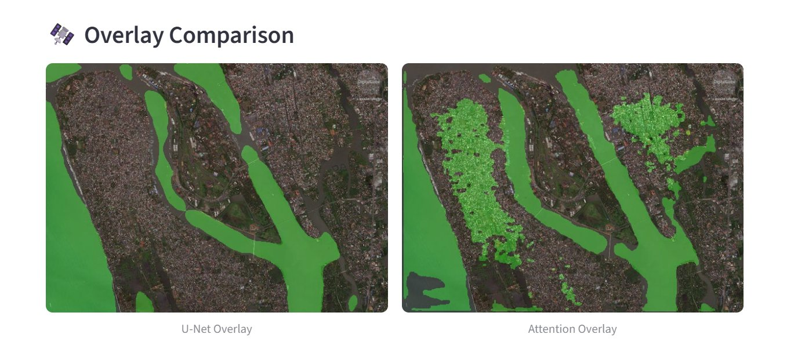
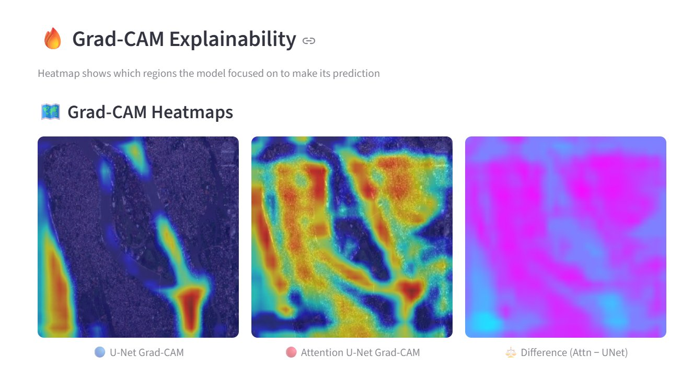
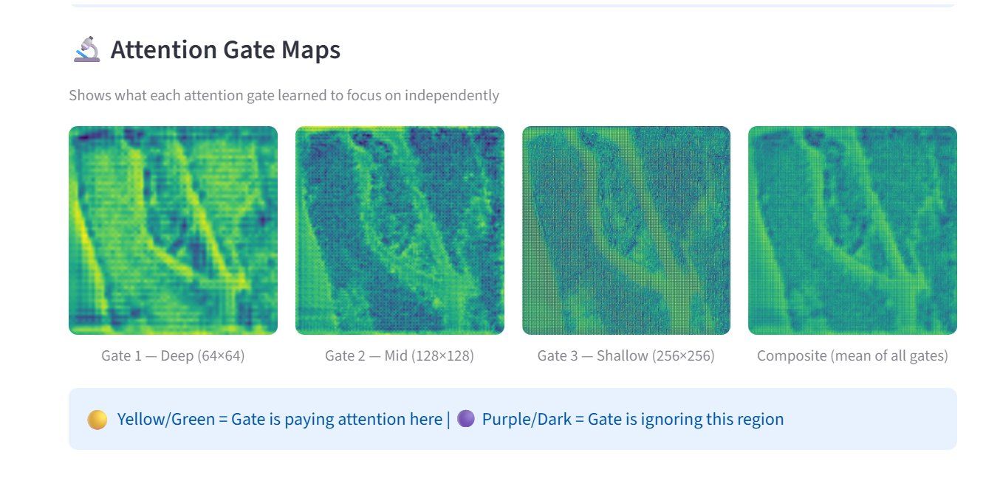

🌊 Flood Area Segmentation — U-Net vs Attention U-Net
<div align="center">


Automated flood area segmentation from aerial drone imagery using deep learning.  
Comparing U-Net vs Attention U-Net with Grad-CAM explainability.
</div>
---
📋 Table of Contents
Overview
Key Results
App Screenshots
Features
Architecture
Dataset
Installation
How to Run
Project Structure
Contributors
---
🔍 Overview
Floods are among the most devastating natural disasters worldwide. This project builds an automated deep learning pipeline to detect and segment flood-affected areas from aerial drone imagery.
We implement and compare two architectures:
U-Net — standard encoder-decoder segmentation network
Attention U-Net — enhanced with learnable attention gates that selectively focus on flood-relevant regions
We also apply Grad-CAM to explain model predictions visually, and deploy the entire system as an interactive Streamlit web application.
---
📊 Key Results
Model	IoU	Dice	Precision	Recall
U-Net	0.4393	0.5644	0.8426	0.4815
Attention U-Net	0.7756	0.8658	0.8690	0.8798
> 🏆 **Attention U-Net achieves 76.6% improvement in IoU over standard U-Net!**
---
📸 App Screenshots
🧠 Model Outputs — Flood Coverage & Segmentation Masks

> U-Net detects **23.14%** flood coverage | Attention U-Net detects **33.88%** — more complete and accurate
---
🛰️ Overlay Comparison

> Green regions = predicted flood areas. Attention U-Net captures significantly more flood extent.
---
🔥 Grad-CAM Explainability

> Red/Yellow = high model activation | Blue = low activation | Right map shows where Attention U-Net focuses differently from U-Net
---
🔬 Attention Gate Maps

> Three attention gates operating at different spatial scales (64×64, 128×128, 256×256) + composite mean
---
✨ Features
 Side-by-side comparison of U-Net and Attention U-Net segmentation
 Adjustable thresholds for each model via sidebar sliders
 Green overlay visualization showing flood regions on original image
 Flood coverage percentage displayed for both models
 Before vs After slider comparison widget
 Grad-CAM heatmaps showing model focus regions
 Attention gate maps at 3 spatial scales
 Morphological noise removal post-processing
 Download results as PNG
 Fully interactive Streamlit web app
---
Architecture
U-Net
```
Input (3×256×256)
    ↓
Encoder: [Conv-BN-ReLU]×2 + MaxPool  →  64 → 128 → 256 channels
    ↓
Bottleneck: 512 channels + Dropout(0.3)
    ↓
Decoder: ConvTranspose + Skip Connection + [Conv-BN-ReLU]×2
    ↓
Output: 1×256×256 (sigmoid)
```
Attention U-Net
Same as U-Net but skip connections pass through Attention Gates:
```
Attention Gate:
  g (decoder signal) + x (encoder skip)
        ↓
  1×1 Conv → BN → ReLU → 1×1 Conv → BN → Sigmoid
        ↓
  α ∈ [0,1]  →  x * α  (attended features)
```
Three gates: `att1` (64×64), `att2` (128×128), `att3` (256×256)
---
📦 Dataset
Name: Flood Area Segmentation
Source: Kaggle — faizalkarim/flood-area-segmentation
Size: 290 RGB aerial/drone images + binary masks
Annotation: Self-annotated using Label Studio
Split: 70% train | 20% validation | 10% test
---
⚙️ Installation
```bash
# 1. Clone the repository
git clone https://github.com/Saniyakhannn/flood-area-segmentation.git
cd flood-area-segmentation

# 2. Install dependencies
pip install -r requirements.txt
```
Requirements:
```
torch>=2.0
streamlit>=1.28
opencv-python>=4.8
Pillow>=10.0
numpy>=1.24
matplotlib>=3.7
streamlit-image-comparison
```
---
🚀 How to Run
```bash
streamlit run app.py
```
Then open your browser at `http://localhost:8501`
Steps:
Upload any flood drone image (JPG/PNG)
Both models run automatically
Adjust thresholds in the sidebar if needed
Enable Grad-CAM and Attention Gates from sidebar
Download results using the download button
> **Note:** You need the trained model weights:
> - `unet_flood_model.pth` — trained U-Net weights
> - `best_model_attention.pth` — trained Attention U-Net weights
---
📁 Project Structure
```
flood-area-segmentation/
│
├── app.py                    # Streamlit web application
├── predict.py                # Model inference functions
├── unet_flood_model.py       # U-Net architecture
├── attention_unet_model.py   # Attention U-Net architecture
├── gradcam_flood.py          # Grad-CAM & attention map extraction
├── dataset.py                # Dataset loading & augmentation
├── history.json              # Training history logs
├── requirements.txt          # Python dependencies
│
└── assets/                   # Screenshots for README
    ├── ss_model_outputs.png
    ├── ss_overlay.png
    ├── ss_gradcam.png
    └── ss_att_gates.png
```
---
Training Details
Parameter	Value
Optimiser	Adam (lr=1e-4, weight_decay=1e-5)
Loss Function	0.3 × BCE + 0.7 × Dice
Batch Size	8
Max Epochs	30
Early Stopping	Patience = 5
LR Scheduler	ReduceLROnPlateau (factor=0.3)
Gradient Clipping	Max norm = 1.0
Model Saved By	Best validation Dice score
---
👥 Contributors
<table>
  <tr>
    <td align="center">
      <b>Sania Usman</b><br>
      <a href="https://github.com/Saniyakhannn">@Saniyakhannn</a>
    </td>
</tr>
</table>
---
📄 License
This project is licensed under the MIT License.
---
<div align="center">
⭐ If you found this project helpful, please give it a star! ⭐
</div>
